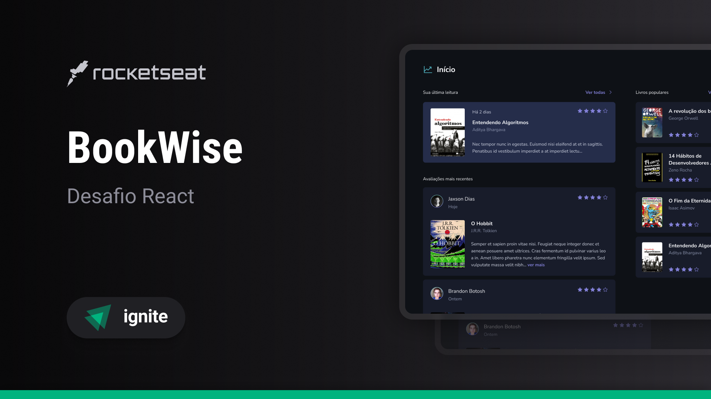

<div align="center">
    
    <p>Connect readers to rate and share their opinions.</p>
</div>




## 💻 Overview
This application was developed as challenge of Ignite program by RocketSeat. The Bookwise app is a recommendation platform for readers, a place where they can rate and view reviews from other readers about a wide variety of books.

[](https://www.figma.com/design/upC6UTsoMbhz6mNoHSkV5R/BookWise--%E2%80%A2-Desafio-React-(Copy)?t=AY5038fOVmiLCCfM-1)

## ✅ Features

- [x] 📚 Search and Discover Books: Easily find books by title, author, or genre.
- [x] 🌟 Rate and Review: Share your thoughts by rating books and writing detailed reviews.
- [x] 👤 User Profiles: Explore profiles to view their favorite books.
- [x] 📖 Book Details: Dive into comprehensive information about each book, including ratings, reviews, and descriptions.


## 👉 Run project

This project consists of two main components:

1. **Frontend**: Built with Next.js, located in the ``bookwise-web`` folder.
2. **Backend**: Built with Django, located in the ```bookwise-server``` folder.

Follow the steps below to set up and run the project locally:

---

### Prerequisites

Ensure you have the following installed on your system:

- Node.js (LTS version recommended)
- Python (3.8 or higher)
- Pip (Python package manager)
- Virtualenv (optional but recommended)
- Yarn or npm

#### Setup and Run

1. Clone the Repository

```bash
$ git clone https://github.com/KassiaMabily/bookwise.git
$ cd bookwise
```
2. Environment Variables

**Backend(.env)**

```env
GITHUB_CLIENT_ID=your-github-client-id
GITHUB_CLIENT_SECRET=your-github-client-secret
```

**Frontend (.env.local)**
```env
NEXT_PUBLIC_BASE_URL="http://localhost:8000"
NEXT_PUBLIC_TOKEN="@ignite:bookwise"
NEXT_PUBLIC_GITHUB_CLIENT_ID=your-github-client-id
NEXT_PUBLIC_GITHUB_REDIRECT_URI=your-github-client-secret
```

3. Setting Up the Backend (Django)

```bash
# Navigate to the backend folder
$ cd backend

# Create a virtual environment and activate it (optional):
$ python -m venv venv
$ source venv/bin/activate  # On Windows: venv\Scripts\activate

# Install dependencies
$ pip install -r requirements.txt

# Set up the database (Sqlite)
$ python manage.py migrate

# (Optional) Load initial data:
$ python manage.py loaddata categories books

# Start the Django development server:
$ python manage.py runserver
```

4. Setting Up the Frontend (Next.js)

```bash
# Navigate to the frontend folder
$ cd frontend

# Install dependencies
$ npm install

# Start the development server
$ npm run dev
```


### Access the Application

Frontend: Open http://localhost:3000

Backend: Access the API at http://localhost:8000
